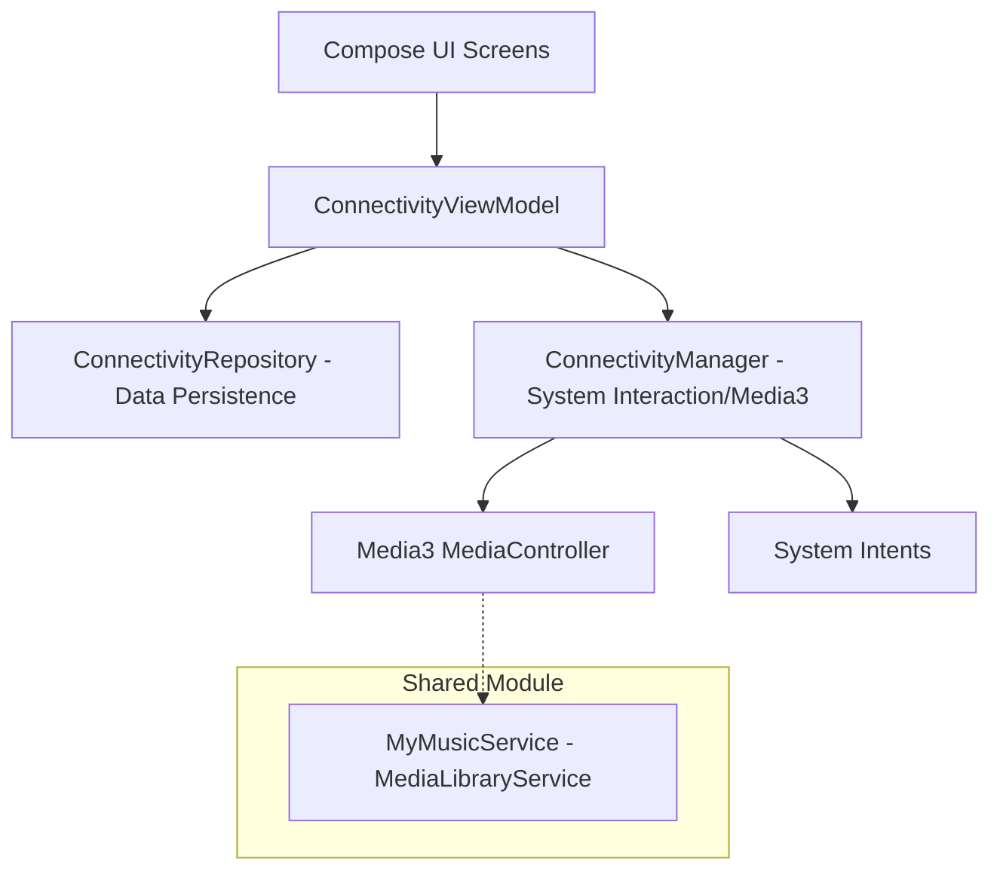

# CarSetting - Android Automotive OS Learning Project

This project is a vehicle settings application demo developed based on **Android Automotive OS (AAOS)**. It aims to explore Compose UI layout, multi-page navigation management, Media3 media service architecture, and inter-app interaction logic.

## 🏗 Project Architecture

The project adopts a layered design pattern of **MVVM** combined with **Manager + Repository** to achieve complete decoupling of UI, business logic, and data storage.

### Architecture Diagram

### Layer Responsibilities:
*   **UI Layer**: Built with Jetpack Compose, responsively updates the interface through `StateFlow`, following the "Dumb UI" principle, responsible only for display and sending intents.
*   **ViewModel**: Responsible for coordinating data streams and user intents, managing UI state.
*   **Manager Layer**: Specialized in handling interaction logic with system services and other apps. For example, multimedia status monitoring (Media3) and external application navigation (Intent).
*   **Repository Layer**: Responsible for persistent storage of local configuration data (e.g., settings saved via DataStore or Mock implementations).

## 🚀 Core Features & Technical Highlights

### 1. Media3 Media Service Integration (`MediaLibraryService`)
The project deeply implements the Media3 stack, capable of both consuming media and acting as a server:
*   **MyMusicService**: Inherits from `MediaLibraryService`, building a complete Media Browse Tree.
*   **Session Interaction**: Manages playback state via `MediaLibrarySession` and configures `sessionActivity`.
*   **Deep Inter-app Navigation**: Utilizes `MediaController` in the settings app to obtain the `PendingIntent` of `sessionActivity`, achieving secure navigation from settings to the music playback page.

### 2. MVI Architecture & Responsive UI Refresh
The project adopts the **MVI (Model-View-Intent)** pattern to enhance data stream predictability:
*   **Intent**: The UI layer expresses user operations by sending explicit `Intent`s (e.g., `DrivingIntent`).
*   **State**: The ViewModel maintains a single source of truth `StateFlow`, ensuring UI state consistency.
*   **Unidirectional Data Flow**: Strictly follows UDF principles, simplifying logic maintenance for complex setting items.

### 3. LocaleManager Global Language Switching
Implemented the ability to quickly switch between Chinese and English without restarting the Activity:
*   **Dynamic Configuration**: Uses `createConfigurationContext` to dynamically override the Context, achieving in-app language switching independent of the system language.
*   **Seamless Refresh**: Combined with the Compose `CompositionLocal` mechanism, UI updates are near-instantaneous upon language switching, without interface redrawing or flickering.

### 4. Navigation & State Persistence
*   Integrated **Jetpack Navigation Compose** to build the routing system.
*   Combined with **HorizontalPager** to achieve smooth switching between the four main pages: Driving, Comfort, Safety, and Connectivity.
*   Ensures that scroll positions and UI states of each page are accurately maintained during page switching and app suspension.

## 📁 Directory Structure

*   `:app-settings`: Main automotive settings app module.
*   `:app-music`: Mock music player app used to verify inter-app navigation.
*   `:shared`: Shared module containing `MyMusicService`, common data models, and UI components.

## 🛠 Tech Stack

*   **Language**: Kotlin
*   **UI Framework**: Jetpack Compose
*   **Architecture**: MVVM + Manager/Repository
*   **Navigation**: Navigation Compose + Pager
*   **Media**: Media3 (MediaController, MediaLibraryService)
*   **Minimum SDK**: 34 (Android 14)
