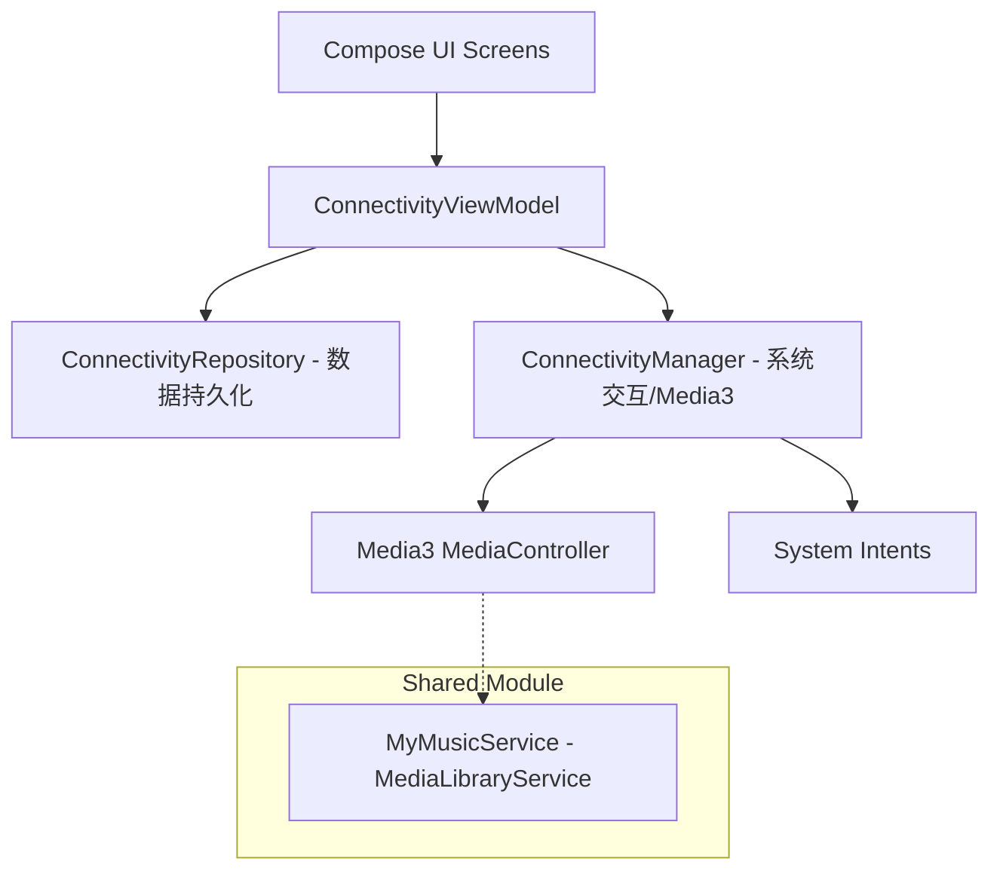

# CarSetting - Android Automotive OS Learning Project

本项目是一个基于 **Android Automotive OS (AAOS)** 开发的车辆设置应用 Demo。旨在探索 Compose UI 布局、多页面导航管理、Media3 媒体服务架构以及跨应用（Inter-app）交互逻辑。

## 🏗 项目架构

项目采用了 **MVVM** 结合 **Manager + Repository** 的分层设计模式，以实现 UI、业务逻辑与数据存储的彻底解耦。

### 分层职责说明：
*   **UI 层**: 使用 Jetpack Compose 构建，通过 `StateFlow` 响应式更新界面，遵循 "Dumb UI" 原则，仅负责展示和发送意图。
*   **ViewModel**: 负责协调数据流和用户意图（Intents），管理 UI 状态。
*   **Manager 层**: 专门处理与系统服务及其他 App 的交互逻辑。例如多媒体状态监听（Media3）和外部应用跳转（Intent）。
*   **Repository 层**: 负责本地配置数据的持久化存储（如通过 DataStore 或 Mock 实现的设置保存）。

## 🚀 核心功能与技术点

### 1. Media3 媒体服务集成 (`MediaLibraryService`)
项目深入实现了 Media3 堆栈，不仅能够消费媒体，还能作为服务端：
*   **MyMusicService**: 继承自 `MediaLibraryService`，构建了完整的 Media Browse Tree。
*   **Session 交互**: 通过 `MediaLibrarySession` 管理播放状态，并配置 `sessionActivity`。
*   **跨应用深度跳转**: 在设置应用中利用 `MediaController` 获取 `sessionActivity` 的 `PendingIntent`，实现从设置到音乐播放页面的安全跳转。

### 2. 精准系统导航与 Intent 适配
针对 AAOS 场景实现了多种精准跳转方案：
*   **蓝牙音频**: 使用 `android.car.intent.action.MEDIA_TEMPLATE` 配合 `EXTRA_MEDIA_COMPONENT` 直接定位至系统媒体中心的蓝牙音源。
*   **连接管理**: 实现了跳转至“已连接设备 (Connected Devices)”页面，用于管理投屏和蓝牙连接。
*   **Android 14+ 适配**: 正确处理了后台 Activity 启动限制，配置了 `PendingIntentBackgroundActivityStartMode`。

### 3. Navigation 与状态保持
*   集成 **Jetpack Navigation Compose** 构建路由系统。
*   结合 **HorizontalPager** 实现驾驶、舒适、安全、互联四个主页面的平滑切换。
*   确保了在页面切换及应用挂起时，各页面的滑动位置和 UI 状态能得到准确保持。

## 📁 目录结构

*   `:app-settings` (原 `automotive`): 车载设置主 App 模块。
*   `:app-music` (原 `mobile`): 模拟音乐播放器 App，用于验证跨应用跳转。
*   `:shared`: 共享模块，包含 `MyMusicService`、通用数据模型及 UI 组件。

## 🛠 技术栈

*   **Language**: Kotlin
*   **UI Framework**: Jetpack Compose
*   **Architecture**: MVVM + Manager/Repository
*   **Navigation**: Navigation Compose + Pager
*   **Media**: Media3 (MediaController, MediaLibraryService)
*   **Minimum SDK**: 34 (Android 14)

